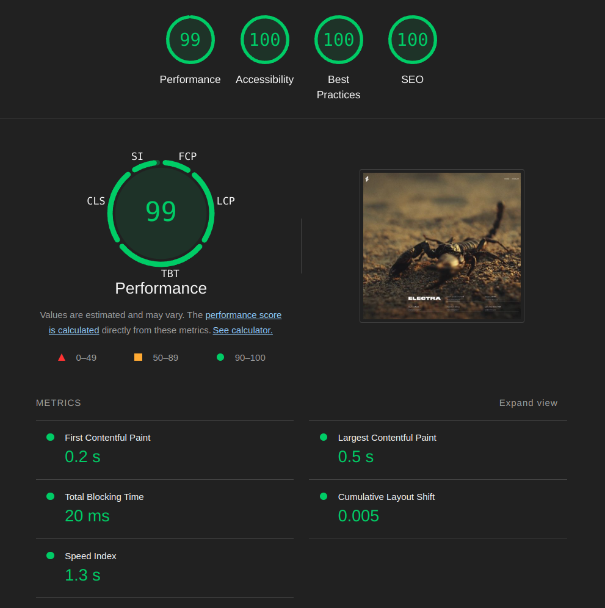

# ⚡️ Electra-Website

Bienvenue sur **Electra-Website** ! Ce projet est une application web moderne, fluide et interactive, développée avec des technologies de pointe pour offrir une expérience utilisateur immersive.

## 🚀 Fonctionnalités  

Electra-Website intègre plusieurs fonctionnalités avancées pour une navigation dynamique et agréable :  

- 🎥 **Lecture de vidéos intégrée** 
- 🎬 **Vidéo modal** 
- 🎨 **Transitions et effets visuels**
- 🔥 **Design responsive**

## 🛠️ Technologies utilisées  

Ce projet a été construit avec les technologies suivantes :  

### 📌 **Frontend**  
- **Next.js** – Framework React offrant un rendu rapide et optimisé.  
- **React** – Bibliothèque JavaScript pour des interfaces utilisateur réactives.  
- **Tailwind CSS** – Framework CSS utilitaire pour un design moderne et flexible.  

### 🌐 **Déploiement & Performance**  
- **Vercel** – Hébergement rapide et optimisé avec support SSR/SSG.  
- **Optimisation des images et polices** – Chargement performant avec [next/image](https://nextjs.org/docs/api-reference/next/image) et [next/font](https://nextjs.org/docs/basic-features/font-optimization).  

---

🎯 **Accédez au site en ligne :** [👉 Lien vers Electra-Website sur Vercel](#)  
Merci de votre visite et bonne navigation ! 🚀  
